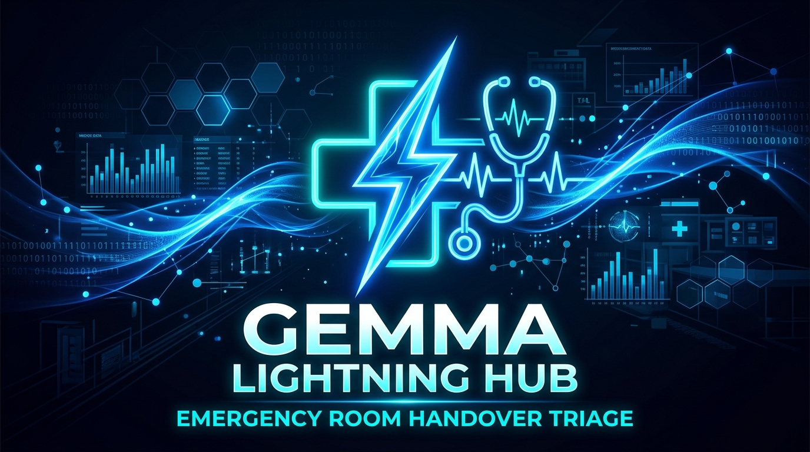

# 🚑 ER Handover Triage — Gemma Lightning Hub

**Kaggle Build with Gemma Hackathon — Healthcare Track**

## 1. Project Title
**Triage in Light Speed: ER Handover Triage powered by Gemma**

## 2. Pitch Video
*(Insert YouTube / Loom Link Here)*

## 3. Short Description
Reducing friction in the Emergency Room handover chain (**Paramedic ➔ Nurse ➔ Doctor**) for critical patients using Gemma for multimodal scribing, 3-step ESI triage, historical lookback audit, and clinical ICD-10 coding — unified by a single continuous patient record.

## 4. The Problem: Friction in Clinical Handovers
Handing over critical patients under high stress in emergency rooms leads to lost details, delayed triage, and miscommunicated history. 
- **Paramedics** struggle with chaotic verbal dictations during transport.
- **Nurses** must manually re-type symptoms while assessing patients, often missing past medical history & severe allergies.
- **Doctors** inherit incomplete notes without prioritized acuity rankings, delaying care for the most critical patients.

## 5. Our Solution: Triage in Light Speed with Gemma
We built the **Gemma Lightning Hub**, a lightweight Python web app that creates one continuous patient journey. It uses a single shared FHIR-lite patient record progressively enriched across three persona-tailored tabs:

1. **🚑 Paramedic Intake:** Hands-free dictation & injury photo auto-structured in 10 seconds into a standard MIST (Mechanism, Injury, Signs, Treatment) grid.
2. **🩺 Nurse Review:** Automated extraction of medical entities, cross-referencing 2-3 prior visits for high-risk flags, and executing a visible 3-step ESI Chain-of-Verification (CoV) triage.
3. **👨‍⚕️ Doctor Queue:** Live patient queue automatically sorted by ESI acuity. Allows doctors to assign clinical staff and dictate bedside assessments with suggested ICD-10 codes.

## 6. Core Value Proposition & Hackathon Alignment

Our solution directly aligns with the Kaggle competition evaluation criteria:

### 🎙️ Multimodal use of Gemma
- **Hands-Free Audio STT:** Fast Multimodal Audio transcription for Paramedic and Doctor dictations.
- **Injury Photo Vision Tagging:** Gemma vision extracts concise 3-word tags from trauma photos.
- **Multimodal JSON Synthesis:** Raw audio transcripts and visual tags are synthesized into a structured clinical MIST Grid.

### 💡 Innovation Value Proposition
- **Continuous Patient Record:** A single record across all 3 tabs ensures zero data loss between handovers.
- **3-Step Chain-of-Verification (CoV):** We don't just output a number. Gemma extracts Red Flags ➔ Proposes Preliminary Score ➔ Self-Critiques against clinical traps ➔ Outputs Final Verified ESI Score with rationale.
- **90% Time Reduction:** What normally takes 5+ minutes of manual charting is executed by Gemma in under 10 seconds.

### 🔒 Healthcare Data Privacy (Edge / Local Gemma)
- **Local Edge Execution:** Designed to keep Protected Health Information (PHI) inside the ambulance and hospital boundaries.
- **Air-Gapped Confidentiality:** Ready for on-premise, secure deployment without relying on third-party cloud data persistence.
- **Local Audit Trail:** Uses a local, HIPAA-compliant-ready SQLite database (FHIR-lite schema) that never leaves the edge device.

### 🔑 Authentication & Secure Access
- **Role-Based Access Control (RBAC):** Distinct UX paths for Paramedics, Nurses, and Doctors.
- **Clinician Staff Assignment:** Doctors can securely assign staff (e.g., "Dr. Smith - Attending") to cases.
- **Immutable Timestamped Audit Trail:** Every Gemma interaction is logged securely to the SQLite backend.

## 7. Technical Architecture & Data Model

Designed as a lightweight, stateless Python backend built on Gradio for clinical resilience and rapid inference.

- **Gradio UI Layer:** Event-driven blocks (paramedic, nurse, doctor) triggering asynchronous Python callbacks.
- **Service Layer (Gemma GenAI):** Stateless modules executing precise prompts against Gemini/Gemma models for MIST synthesis, CoV scoring, and ICD-10 coding.
- **Persistence (Thread-Safe SQLite):** No long-lived DB connections. Fresh read/write per callback ensures UI tabs never drift out of sync. Uses a FHIR R4-Lite schema (`patients`, `encounters`, `conditions`, `allergies`, `observations`).

## 8. Why We Built This
We wanted to tackle a real-world healthcare bottleneck. The handover from EMS to ED Nurse to ED Doctor is notoriously fragile. By using Gemma's multimodal capabilities, we remove the cognitive burden of data entry and allow clinicians to focus on what matters most: saving patient lives.

## 9. Next Steps / Future Scope
- Expand the FHIR database integration to connect directly with existing hospital EHR systems (Epic, Cerner).
- Deploy fully localized Gemma models on ruggedized ambulance tablets for complete offline support.
- Implement live camera feeds for continuous real-time vital sign extraction.

---
**Try it out Live:** [Hugging Face Space Live Demo](https://huggingface.co/spaces/zsiddiqi/lighteninghub-app)
