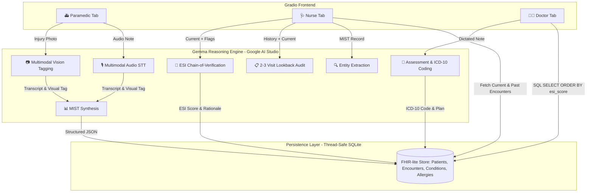
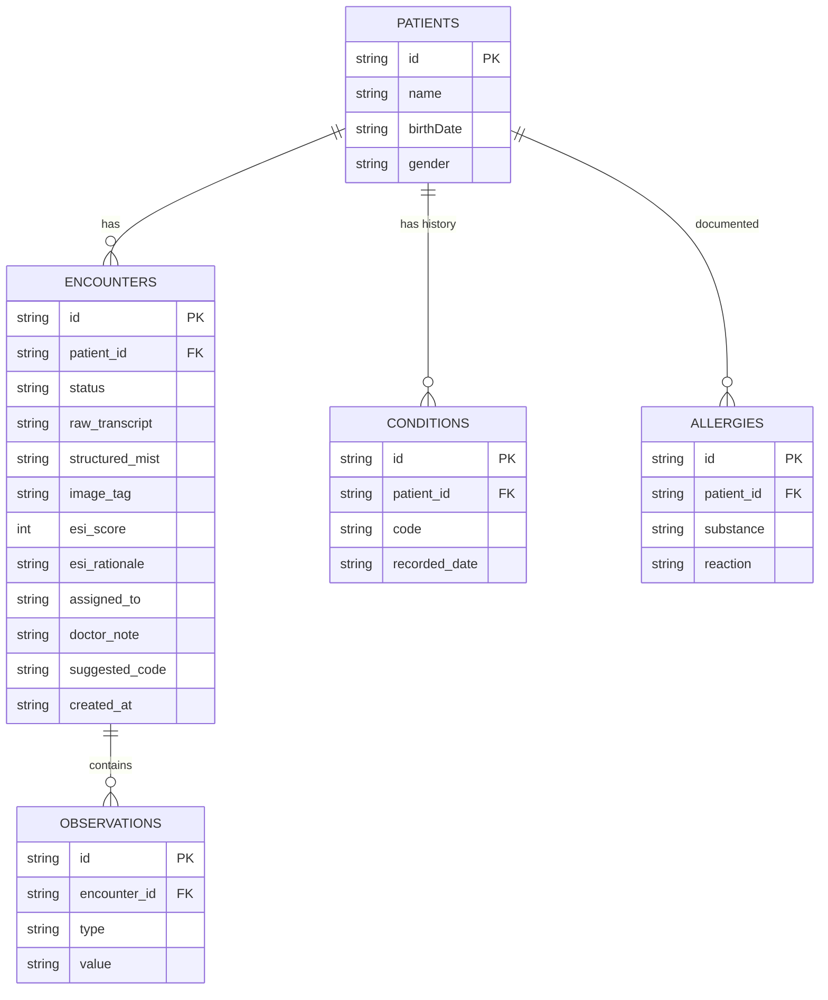

# ER Handover Triage — Gemma Lightning Hub: Presentation & Architecture Design Document

This document provides complete architecture diagrams, sequence diagrams, clinical data flow models, and pitch narrative frameworks for presenting **ER Handover Triage — Gemma Lightning** to judges, clinicians, and hackathon evaluators.

---

## 1. Executive Summary & Pitch Narrative

### The Clinical Problem
In Emergency Departments worldwide, patient handover is a high-friction bottleneck. When paramedics transfer critical patients to the ER nurse, vital details are often lost in verbal dictations, delayed by manual data entry, or fragmented across shift handovers. This friction leads to miscalculated triage scores, missed historical contraindications, and delayed critical interventions.

### Our Solution
**ER Handover Triage — Gemma Lightning** provides **a single continuous patient record** progressively enriched across three persona-tailored tabs:

```
🚑 Paramedic Intake         ➡️         🩺 Nurse Review         ➡️         👨‍⚕️ Doctor Queue
Hands-free dictation + photo      Entity extraction, lookback,      Ranked acuity queue,
  Synthesized MIST Grid              Visible 3-step ESI CoV         ICD-10 clinical coding
```

### Key Technical Innovations
1. **10-Second Handover Synthesizer:** Converts unstructured speech and injury photos into a standardized, color-coded MIST (Mechanism, Injury, Signs, Treatment) clinical grid using Gemma multimodal inference.
2. **High-Sensitivity ESI Triager with Chain-of-Verification (CoV):** Proactively prevents over- and under-triage by enforcing a visible 3-step reasoning trail (Red Flags ➔ Preliminary Score ➔ Self-Critique Guardrails ➔ Final Score).
3. **2–3 Visit Historical Lookback Summarizer:** Automatically cross-references current complaints with prior encounters and allergies stored in a FHIR-lite SQLite database.

---

## 2. High-Level System Architecture



---

## 3. End-to-End Clinical Data Flow (Sequence Diagram)

The following sequence diagram illustrates how a single patient record moves seamlessly from ambulance capture to ER doctor execution:

```mermaid
sequenceDiagram
    autonumber
    actor Paramedic
    actor Nurse
    actor Doctor
    participant UI as Gradio Frontend
    participant Gemma as Gemma Reasoning Engine
    participant DB as SQLite (FHIR-lite DB)

    %% Step 1: Paramedic Capture
    rect rgb(30, 41, 59)
    Note over Paramedic, DB: Step 1: Paramedic Intake & MIST Synthesis
    Paramedic->>UI: Dictate Handover Note (Audio) & Upload Injury Photo
    UI->>Gemma: Transcribe Audio (Gemini Multimodal) & Tag Image
    Gemma-->>UI: Return Raw Transcript & Visual Tag ("severe wrist swelling")
    UI->>Gemma: Synthesize MIST (Transcript + Visual Tag)
    Gemma-->>UI: Return Structured MIST JSON
    UI->>DB: INSERT into `encounters` & `patients`
    UI-->>Paramedic: Display Structured Color-Coded MIST Grid
    end

    %% Step 2: Nurse Review
    rect rgb(15, 23, 42)
    Note over Nurse, DB: Step 2: Nurse Audit & ESI Chain-of-Verification
    Nurse->>UI: Select Patient & Click "Load Patient Record"
    UI->>DB: SELECT recent `encounters`, `conditions`, `allergies`
    DB-->>UI: Return Patient History & Current Intake
    UI->>Gemma: Extract Entities & Summarize Lookback Flags
    Gemma-->>UI: Return Extracted Entities & Clinical Flags
    Nurse->>UI: Click "Calculate ESI Score with CoV"
    UI->>Gemma: Run 3-Step ESI CoV (Red Flags -> Prelim -> Self-Critique -> Final)
    Gemma-->>UI: Return ESI Level (1-5), Red Flags, Critique & Rationale
    UI->>DB: UPDATE `encounters` set `esi_score`, `esi_rationale`
    UI-->>Nurse: Display ESI Badge & Visible Reasoning Accordion
    end

    %% Step 3: Doctor Queue
    rect rgb(30, 58, 138)
    Note over Doctor, DB: Step 3: Doctor Prioritized Queue & Execution
    Doctor->>UI: Open Doctor Tab & Click "Refresh Queue"
    UI->>DB: SELECT * FROM encounters ORDER BY esi_score ASC
    DB-->>UI: Return Ranked Active Patient Queue
    UI-->>Doctor: Display Prioritized Queue (ESI 1 at top)
    Doctor->>UI: Select Patient, Assign Staff & Dictate Doctor Assessment
    UI->>Gemma: Structure Doctor Note & Suggest ICD-10 Code
    Gemma-->>UI: Return Clinical Plan & Suggested ICD-10 Code (e.g., I21.09)
    UI->>DB: UPDATE `encounters` set `assigned_to`, `doctor_note`, `suggested_code`
    UI-->>Doctor: Display Coded Assessment Card
    end
```



---

## 4. Chain-of-Verification (CoV) Deep Dive

To prevent dangerous LLM hallucinations or overconfidence in clinical settings, our ESI calculation enforces a **3-step Chain-of-Verification**:


### The 3 Verification Steps:
1. **Red Flag Audit:** Scans for explicitly compromised vital signs, respiratory distress, or hemodynamic instability.
2. **Preliminary Scoring:** Maps findings to standard Emergency Severity Index levels (1 = Resuscitation to 5 = Non-urgent).
3. **Self-Critique:** Evaluates the preliminary score against over-triage and under-triage traps (e.g., *"Did I miss high-risk pain indicators or silent hypoxia?"*).

---

## 5. Database Schema (FHIR R4-Lite)

Our lightweight, thread-safe SQLite database uses a subset of the **FHIR R4 specification**:



---

## 6. Presentation Pitch Deck Outline (3-Minute Hackathon Pitch)

### Slide 1: Title & Hook (30 sec)
* **Title:** ER Handover Triage — Gemma Lightning
* **Subtitle:** Eliminating ER Handover Friction with Gemma-Powered Multimodal Continuity
* **Hook:** *"Every year, millions of critical patient details are miscommunicated during the chaotic handover from ambulance to emergency room. We built a system that turns 30 seconds of spoken noise into a structured, prioritized clinical workflow."*

### Slide 2: Demo Walkthrough (90 sec)
* **Paramedic View:** Show dictation of an acute chest pain note + injury photo upload. Highlight the instant **MIST Grid** generation.
* **Nurse View:** Show automatic entity extraction, historical lookback flags (warning of prior STEMI/allergies), and the **Chain-of-Verification ESI Badge**.
* **Doctor View:** Show the **Live Acuity Queue** where ESI Level 1 automatically floats to the top, staff assignment, and dictation of doctor assessment with **suggested ICD-10 coding**.

### Slide 3: Why Gemma & Architecture (40 sec)
* **Multimodal Reasoning:** Audio transcription, visual tagging, and clinical NLP powered by `gemini-flash-latest`.
* **Clinical Safety First:** Chain-of-Verification (CoV) guarantees visible reasoning rather than black-box outputs.
* **Single Source of Truth:** Lightweight, zero-latency FHIR-lite SQLite persistence ensures complete consistency across all 3 views.

### Slide 4: Impact & Summary (20 sec)
* **Impact:** Reduced triage time, zero missed red-flag history, transparent clinical decision support.
* **Tagline:** *"Gemma Lightning: Speed when every second counts."*
